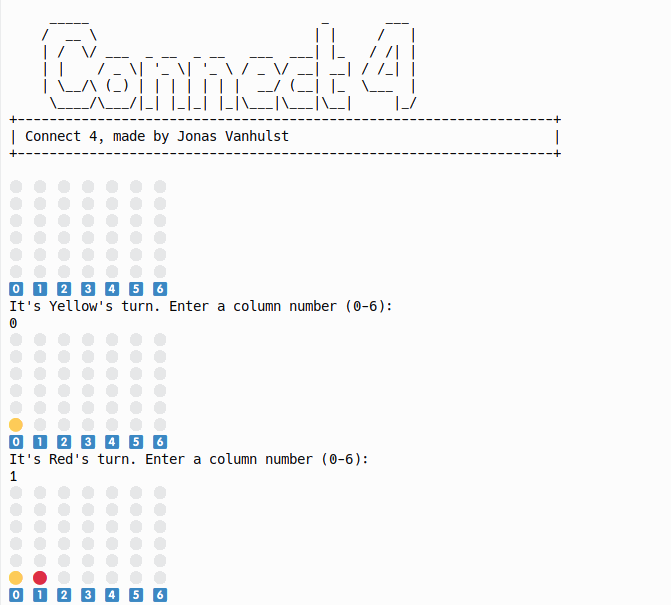

<!-- PROJECT LOGO -->
 

  

  <h3 align="center">Swift Programming</h3>

  

  An awesome guide to jumpstart the Game & my programming journey!
   
   
  <a href="https://github.com/JonasVanhulst/SwiftAdventures/Connect4">View Demo</a>
  ·
  <a href="https://github.com/JonasVanhulst/SwiftAdventures/issues">Report Bug</a>
  ·
  <a href="https://github.com/JonasVanhulst/SwiftAdventures/issues">Request Feature</a>
  

<!-- ABOUT THE PROJECT -->
## About The Project
Welcome to my Swift Learning Journey! Join me on this journey to understand Swift comprehensively. This project represents my commitment to mastering the Swift programming language through a structured learning path, from foundational exercises to a full-fledged project.

 
The journey began with foundational exercises to familiarise myself with Swift syntax, data types, control flow structures, and essential programming concepts.

These exercises served as building blocks, laying a solid groundwork for my journey towards proficiency in Swift. As a final touch to this
learning journey, I undertook the challenge of creating a classic game, Connect 4, in Swift. The project consolidated my understanding of the language and provided a practical application of Swift's features and principles in a larger-scale project. Developing Connect 4 in Swift was an enriching experience that allowed me to put my newfound knowledge into practice.

### Built With

This project was developed primarily using the Swift programming language, a versatile and powerful language known for its performance and capabilities. Swift provides a solid foundation for building efficient and high-quality software. For more information about the Swift language and its features, see the [Swift documentation](https://developer.apple.com/documentation/swift).

The development environment for this project is powered by Xcode, an integrated development environment (IDE) designed for building applications on Apple platforms. Xcode simplifies the development process by providing a rich environment with tools for coding, debugging and designing graphical user interfaces. Find out more about Xcode and its capabilities at Apple's [official website](https://developer.apple.com/xcode/).

* 
* 

<!-- ROADMAP -->
## Project Roadmap

- [x] Learning the basics
- [x] Learning advanced functions & operations
- [x] Making exercises on swift.
- [x] Making also a fun game as extra
- [x] Refactor for clean code
- [x] Documented code and GitHub documentation
  
<!-- LICENSE -->
## License

Distributed under the MIT License. See `LICENSE.txt` for more information.

<!-- CONTACT -->
## Contact

Jonas Vanhulst - jonas.vanhulst@student.pxl.be
